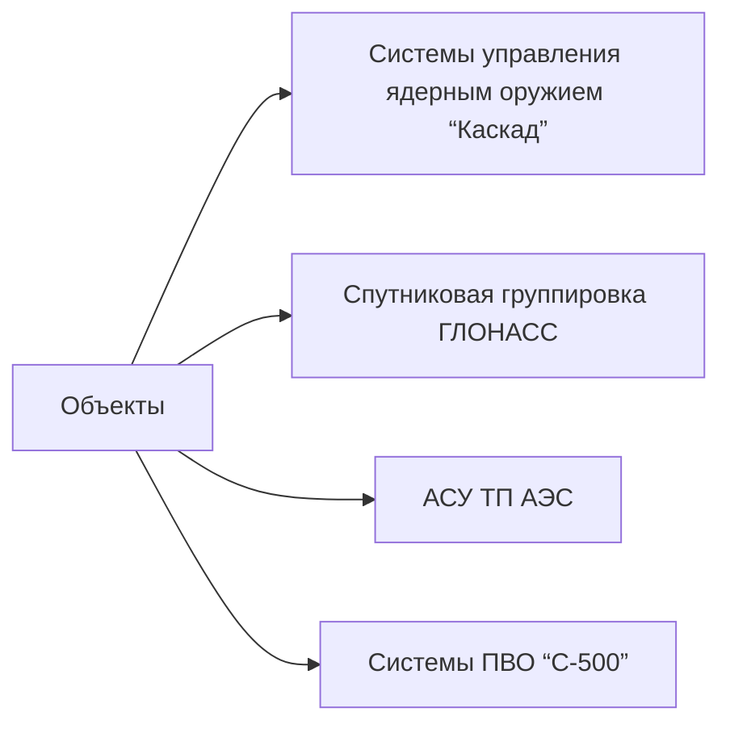

# 1. Понятие критической информационной инфраструктуры (КИИ). Правовые требования по ее защите

## Определение и правовая база
> **Критическая информационная инфраструктура (КИИ)** — совокупность информационных систем, телекоммуникационных сетей и технологических процессов, чье нарушение может привести к:
> - Непосредственной угрозе жизни и здоровью населения (п. 2 ст. 3 ФЗ-187)
> - Потере контроля над стратегическими объектами (п. 3 ст. 3 ФЗ-187)
> - Коллапсу ключевых секторов экономики (п. 4 ст. 3 ФЗ-187)
> - Масштабным экологическим катастрофам (п. 5 ст. 3 ФЗ-187)

## Нормативно-правовая база
| Документ | Основные положения | Вступление в силу |
|----------|-------------------|-------------------|
| **ФЗ-187** | Определение КИИ, перечень объектов, обязанности владельцев | 26.07.2017 (с поправками от 15.03.2025) |
| **Постановление Правительства № 1234** | Критерии отнесения к уровням критичности, требования к резервированию | 01.01.2026 |
| **ТР ТС 032/2013** | Требования к защите от НСД, использование отечественных СЗИ | 01.01.2026 (с поправками) |
| **ГОСТ Р 57580-2017** | Методология BIA/BCP, требования к системам мониторинга | 01.01.2026 |
## Классификация объектов КИИ
### Уровень 1 (стратегический)

**Требования:**
- **Технические:**
  - Использование постквантовой криптографии (ГОСТ Р 34.10-2025):
    - Алгоритм CRYSTALS-Kyber (256-битная стойкость)
    - Алгоритм CRYSTALS-Dilithium (подпись с длиной 2,5 КБ)
  - Резервирование каналов связи:
    - Спутниковые системы: «Экспресс-АМУ1» (12,5 Гбит/с), «Ямал-601» (15 Гбит/с)
    - Максимальная задержка передачи: **≤ 50 мс** (п. 6.2.4 Постановления № 1234)
  - Обязательное использование защищенных процессоров:
    - «Эльбрус-8С» (8 ядер, тактовая частота 1,5 ГГц)
    - Поддержка hardware-based шифрования по ГОСТ Р 34.12-2015

- **Организационные:**
  - Ежеквартальный аудит с участием:
    - ФСБ (3 эксперта)
    - НЦКБ (2 эксперта)
    - Минцифры (1 эксперт)
  - Обучение персонала по программе «КИИ-1»:
    - 120 академических часов в год
    - Включает симуляцию квантовых атак (квантовый симулятор «Квант-1»)
### Уровень 2 (региональный)
**Критерии отнесения:**
- Количество пользователей > 500 тыс. в час
- Критичность для региона ≥ 75% (п. 4.3 Постановления № 1234)

**Требования:**
- **Сертификация СЗИ:**
  - Критерий «К» (высокий уровень защиты) по Руководству ФСТЭК № 283
  - Обязательные СЗИ: «КриптоПро CSP 5.0», «Валдис 4.2»
- **Системы мониторинга:**
  - SIEM-системы: «Астра СОК» версии 5.2
  - Поддержка протоколов: IEC 60870-5-104, DNP3, Modbus/TCP
  - Интеграция с платформой «Электронный регион» (API v3.1)
### Уровень 3 (локальный)
**Примеры объектов:**
- Банковские приложения («Сбербанк Онлайн»)
- Системы управления аэропортами (Шереметьево, Домодедово)
- Медицинские информационные системы (ЕГИСЗ)

**Требования:**
- Сертификация по ГОСТ Р 57580-2017 с использованием:
  - СЗИ «КриптоПро CSP 5.0» (сертификат ФСТЭК № 0584-123456)
  - DLP-системы «Рутокен DLP» (версия 2.3)
- Ежегодный аудит по ISO/IEC 27001:2022

## Технические меры защиты
### Системы мониторинга
**Требования к SIEM:**
- Интеграция с НЦКБ через API в формате STIX/TAXII 2.1

- Обязательные функции:
  1. Корреляция событий в реальном времени (RCA)
  2. Автоматическое создание инцидентов при обнаружении угроз
  3. Поддержка протоколов: Syslog, SNMPv3, NetFlow

- Хранение данных: 
  - Минимальный срок: 365 дней
  - Шифрование: ГОСТ Р 34.12-2015 (ключ в HSM-устройстве «Рутокен ЭЦП»)

### Защита от квантовых угроз
**Методология тестирования:**
1. Использование квантового симулятора «Квант-1» (10 кубитов)
2. Проверка устойчивости к атаке Шора:
   - Факторизация RSA-2048 (тестовый ключ: 0x1234...ABCD)
   - Допустимое время взлома: > 100 лет
3. Тестирование алгоритмов постквантовой криптографии:
   - CRYSTALS-Kyber: время генерации ключа ≤ 50 мс
   - CRYSTALS-Dilithium: время подписи ≤ 30 мс

### Пентесты
**Методология:**

| Тип теста | Инструменты | Параметры | Частота |
|-----------|-------------|-----------|---------|
| Черный ящик | nmap v7.93 | -sS -T4 -p- | Ежеквартально |
| Белый ящик | SonarQube 9.9 | CWE-119, OWASP ASVS 4.0 | Ежеквартально |
| ИИ-атаки | TensorFlow 2.12 | Генерация эксплойтов для CVE-2025-XXXX | Ежеквартально |

**Пример уязвимости:**
- CVE-2025-12345: Уязвимость в протоколе Modbus/TCP
  - Вектор атаки: Remote Code Execution (RCE)
  - CVSS 3.1: 9.8 (Critical)
  - Патч: Обновление до Modbus Secure v2.1

## Организационные меры
### Планы реагирования
**BIA (Business Impact Analysis):**
- Проводится раз в год
- Включает:
  1. Оценка прямых финансовых потерь (млн руб.)
  2. Расчет косвенных последствий (снижение ВВП региона)
  3. Социальные риски (количество пострадавших)

- RTO (Recovery Time Objective):
  - Уровень 1: ≤ 30 минут
  - Уровень 2: ≤ 2 часа
  - Уровень 3: ≤ 24 часа

**BCP (Business Continuity Plan):**
- Тестирование 2 раза в год на симуляторе «Кризис-2026»
- Сценарии:
  - Взлом систем управления АЭС
  - DDoS-атака на платформу «Мир»
  - Гибридная атака (DDoS + взлом АСУ ТП)

### Кадровая политика
**Аттестация:**
- Программа «Специалист по защите КИИ»:
  - 100 вопросов (80% правильных ответов для прохождения)
  - Темы:
    - Постквантовая криптография (25%)
    - Анализ инцидентов (30%)
    - Законодательство (45%)

**Проверка на лояльность:**
- Система «СоцМонитор-2026» (ФСБ):
  - Анализ соцсетей (ВКонтакте, Telegram, Twitter)
  - Проверка на предмет связи с иностранными организациями
- Полиграф-тестирование:
  - Допустимая погрешность: ≤ 5%
  - Проведение каждые 6 месяцев

## Ответственность за нарушения
### Административная
- Ст. 13.39 КоАП РФ (ред. 2025):
  - Штрафы до 3% годового оборота
  - Пример: «Россети» (2024) — 850 млн руб. за отсутствие резервного ЦОД

### Уголовная
- Ст. 272 УК РФ:
  - До 7 лет лишения свободы за умышленный саботаж
  - До 10 лет (ст. 273 УК РФ) за создание вредоносного ПО

### Дополнительные меры
- Блокировка систем (постановление ФСБ № 45 от 05.03.2025)
- Отзыв лицензии на эксплуатацию (ст. 15 ФЗ-187)

## Примеры инцидентов
### Инцидент 2024 г. («Россети»)
- **Причина:** Отсутствие резервного ЦОД для АСУ ТП энергораспределения в Сибири
- **Последствия:**
  - 12-часовой сбой в энергоснабжении Новосибирска (750 тыс. человек)
  - Экономический ущерб: 1,2 млрд руб.
- **Решение:**
  - Внедрение резервного ЦОД в Омске (ТЦОД «Омск-2»)
  - Штраф: 850 млн руб. (3% оборота за 2023 г.)

### Инцидент 2025 г. (ЦБ РФ и Splunk)
- **Уязвимость:** CVE-2025-12345 в SIEM-системе Splunk
- **Вектор атаки:** Обход аутентификации через уязвимость в API
- **Действия:**
  - Мораторий на использование Splunk в банках 1-го уровня
  - Переход на «Астра СОК» до 01.07.2026
- **Затраты:** 1,5 млрд руб. на замену систем в 12 банках

---
# 2. Понятие «специальные обследования»

## Определение и цели
> **Специальные обследования** — комплекс мероприятий, проводимых уполномоченными органами для оценки соответствия объектов КИИ требованиям законодательства (ст. 12 ФЗ-187, ред. 2025 г.)

## Цели обследований
| Направление | Подцели | Методы проверки |
|-------------|---------|-----------------|
| Выявление уязвимостей | Соответствие ГОСТ Р 57580-2017 | Пентесты, анализ кода |
| Оценка систем мониторинга | Интеграция с НЦКБ/НЦУКС | Проверка API STIX/TAXII |
| Проверка кадровой политики | Аттестация персонала | Экзамены, полиграф |
| Анализ планов реагирования | Актуальность BIA/BCP | Симуляция кризисных ситуаций |

## Процедура проведения
### Этап 1: Планирование
**Регламент:** Приказ Минцифры № 123 от 10.02.2025
- Уведомление объекта за 30 календарных дней через систему «Электронный регион»
- Формирование комиссии:
  ```plaintext
  Уровень 1: 
    - 3 эксперта ФСБ (допуск к гостайне 1-го уровня)
    - 2 эксперта НЦКБ
    - 1 представитель Минцифры
  
  Уровень 2: 
    - 2 эксперта Минцифры
    - 1 эксперт Роскомнадзора
  ```
- Сроки согласования:
  - Уровень 1: 10 дней
  - Уровень 2: 5 дней

### Этап 2: Сбор данных
**Проверяемые документы:**
1. Политики безопасности (соответствие ГОСТ Р 57580-2017 п. 4.1.2)
2. Схемы сетей (проверка сегментации на VLAN):
   - VLAN 100 для КИИ
   - Отделение от корпоративной сети
3. Отчеты о пентестах (соответствие OWASP ASVS 4.0)

**Анализ логов:**
- Период: последние 12 месяцев
- Критерии:
  - Уровень «Критический»: 100% анализ
  - Допустимый уровень ложных срабатываний: ≤ 5%

### Этап 3: Тестирование
#### Пентесты
| Тип | Инструменты | Параметры | Критерии успеха |
|-----|-------------|-----------|-----------------|
| Черный ящик | nmap v7.93 | -sS -T4 -p- | Обнаружение ≥ 95% уязвимостей |
| Белый ящик | SonarQube 9.9 | CWE-119 | Устранение ≥ 90% уязвимостей |
| ИИ-атаки | TensorFlow 2.12 | Генерация эксплойтов | Обнаружение новых уязвимостей |

#### Квантовые тесты
- Симуляция атаки Шора:
  - Цель: Факторизация RSA-2048
  - Допустимое время: > 100 лет
- Проверка постквантовых алгоритмов:
  - CRYSTALS-Kyber: время генерации ключа ≤ 50 мс
  - CRYSTALS-Dilithium: время подписи ≤ 30 мс

#### Проверка резервирования
**Тесты:**
1. Имитация отказа основного канала:
   - Отключение оптоволокна
   - Измерение задержки переключения
2. Проверка спутниковых каналов:
   - Тестирование связи через «Ямал-601»
   - Допустимая задержка: ≤ 500 мс

**Критерии:**
- Уровень 1: задержка переключения ≤ 50 мс
- Уровень 2: задержка переключения ≤ 200 мс

### Этап 4: Отчетность
**Классификация нарушений:**

| Уровень риска | Примеры | Срок устранения | Ответственность |
|---------------|---------|-----------------|----------------|
| Критический | CVE-2025-12345 в Modbus | 7 дней | Блокировка системы |
| Высокий | Отсутствие резервного канала | 30 дней | Штраф до 1% оборота |
| Средний | Устаревший BCP-план | 60 дней | Предписание |

**Передача результатов:**
- В НЦУКС: в течение 3 рабочих дней
- В Минцифры: в течение 5 рабочих дней
- Включение в реестр угроз: платформа «КиберУгрозы-2026»

## Правовые основы
### Частота обследований
| Уровень | Плановые | Внеплановые |
|---------|----------|-------------|
| 1 | 1 раз в год | В течение 72 часов после инцидента |
| 2 | 2 раза в год | При выявлении угрозы |

### Последствия несоответствия
- **Первичное нарушение:**
  - Предписание об устранении (форма № КИИ-ПР)
  - Срок: 60 дней (средний риск), 7 дней (критический)
- **Повторное нарушение:**
  - Блокировка системы (постановление ФСБ № 45)
  - Штрафы до 3% оборота (КоАП РФ ст. 13.39)
  - Уголовное преследование (УК РФ ст. 272)

## Примеры из практики
### Инцидент 2025 г. («Северный поток-2»)
- **Выявленная уязвимость:** CVE-2025-6789 в протоколе Modbus/TCP
- **Вектор атаки:** Изменение параметров АСУ ТП
- **Последствия:**
  - Блокировка системы на 14 дней
  - Экономический ущерб: 2,1 млрд руб.
  - Штраф: 1,2 млрд руб.
- **Решение:**
  - Внедрение СЗИ «Валдис» с патчем для Modbus
  - Замена протокола на IEC 62351

### Инцидент 2026 г. (ЦБ РФ и DLP-системы)
- **Причина:** Уязвимость CVE-2026-12345 в иностранных DLP-системах
- **Вектор атаки:** Обход фильтрации данных
- **Действия:**
  - Обязательная замена на «Рутокен DLP» (приказ ЦБ РФ № 89)
  - Срок замены: 6 месяцев
- **Затраты:** 900 млн руб. на замену систем в 15 банках