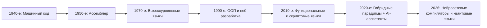
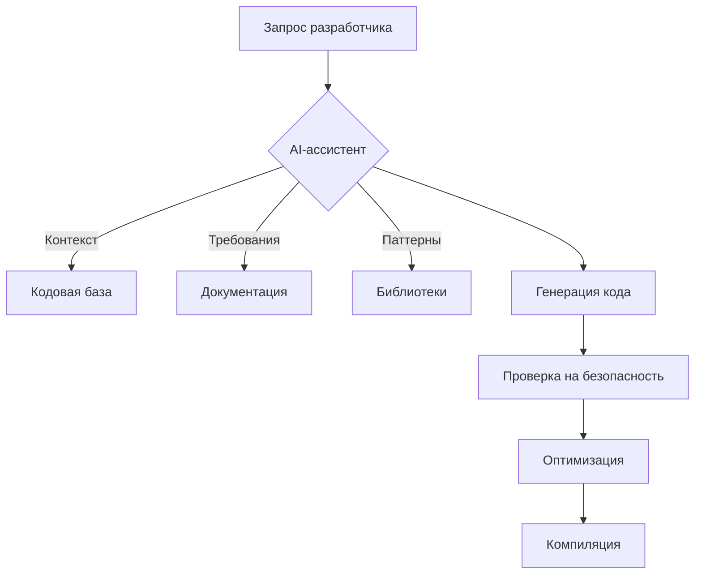

# 🔷 Введение: Программирование в 2026 году

> **Программирование** — не просто написание кода, а **архитектура мышления**, позволяющая создавать решения для цифровой реальности.  
> Современная инженерия ПО включает **AI-ассистентов**, **квантовые алгоритмы** и **нейроморфные вычисления**.

### 🧠 **Эволюция программирования: от машинного кода к ИИ-генерации**

---
# 🗂️ Классификация языков программирования: Глубокий анализ

## 1. По поколениям (с примерами 2026)

| Поколение | Тип языка | Примеры 2026 | Инновации |
|----------|-----------|--------------|-----------|
| **1-е** | Машинные языки | Квантовые инструкции (Q#) | Квантовые алгоритмы для криптографии |
| **2-е** | Ассемблер | RISC-V Assembly | Энергоэффективные embedded-системы |
| **3-е** | Высокоуровневые | **Rust**, **Zig**, **Carbon** | Безопасность памяти, лаконичность |
| **4-е** | Проблемно-ориентированные | **SQL++**, **Datalog**, **GraphQL** | Интеграция с графовыми БД |
| **5-е** | Логические / на основе ограничений | **Prolog++**, **Z3 Solver** | Верификация критически важных систем |

---
## 2. По парадигмам: Современные гибридные подходы
### 📌 Императивная парадигма
> **Эволюция в 2026**:  
> - **Rust** — императивная логика + **безопасность памяти** (без garbage collector)  
> - **Zig** — императивность + **контроль над компиляцией** («C с современным синтаксисом»)

- **Критерии выбора в 2026**:  
  - Для embedded: **Rust** (безопасность) или **C++23** (совместимость)  
  - Для high-performance: **Zig** (низкоуровневый контроль)  

### 📌 Декларативная парадигма  
> **Современные инструменты**:  
> - **Prolog++** — логическое программирование + интеграция с нейросетями  
> - **Datalog** — декларативные запросы к графовым БД (Neo4j, AWS Neptune)

### 📌 Функциональная парадигма
> **Топ-3 языка 2026**:  
> 1. **Haskell** — верификация систем (например, блокчейн-смарт-контракты)  
> 2. **Scala 3** — функциональность + ООП для enterprise-приложений  
> 3. **Elixir** — распределенные системы (включая IoT-сети)

### 📌 Объектно-ориентированная парадигма
> **Эволюция в 2026**:  
> - **Java 21+** — виртуальные потоки (Virtual Threads) для высокой concurrency  
> - **C# 12** — records, primary constructors, pattern matching  
> - **Python 3.14** — типизация через **TypeScript-подобные аннотации**

> 💡 **Гибридные языки 2026**:  
> - **Rust** (императивный + функциональный)  
> - **Kotlin** (ООП + функциональный)  
> - **Swift** (ООП + протокольно-ориентированный)

---
# 🛠️ Системы программирования: Современные инструменты 2026

## 📦 Экосистема разработки: От IDE к AI-ассистентам

| Инструмент | Тип | Особенности 2026 | Примеры |
|------------|-----|------------------|---------|
| **IDE** | Графические среды | Интеграция с AI-генераторами кода | **JetBrains Fleet**, **VS Code 2.0** |
| **Компиляторы** | Трансляция | **Нейросетевые оптимизаторы** (пример: LLVM + ML) | **Rust 2.0**, **Clang 18** |
| **Контейнеризация** | Изоляция | **WASM-контейнеры** для кросс-платформенности | **Docker 25+**, **WASI** |
| **CI/CD** | Автоматизация | **AI-тестирование** (генерация тестовых сценариев) | **GitHub Actions 4.0**, **GitLab CI 17** |

## 🔹 AI-ассистенты в разработке (2026)


> 🌐 **Пример**:  
> В **GitHub Copilot 4.0** можно написать:  
> *«Создай REST API для микросервиса на Rust с аутентификацией JWT и кэшированием Redis»* → ИИ сгенерирует готовый код с документацией.

---
# 📜 Синтаксис и семантика: Новые стандарты 2026
## 📐 Синтаксис: От гибкости к предсказуемости
**Тренд 2026**:  
*«Языки с **минимальным синтаксисом** для уменьшения когнитивной нагрузки»*  
 - **Rust**: `let x = 5;` вместо `int x = 5;`  
- **Zig**: `var x: i32 = 5;` (явная типизация без `int`)

## 🔤 Современные правила идентификаторов

| Язык | Правила | Пример |
|------|---------|--------|
| **Rust** | `snake_case` для переменных, `PascalCase` для типов | `user_id`, `UserProfile` |
| **Zig** | `snake_case` для всего | `user_id`, `user_profile` |
| **Kotlin** | `camelCase` для переменных, `PascalCase` для классов | `userId`, `UserProfile` |

## 🧠 Семантика: Верификация через формальные методы
**Инструменты 2026**:  
- **Rust**: Компилятор проверяет **безопасность памяти** (ownership, borrowing)  
- **Ada 202x**: Статический анализ для критически важных систем (авиация, медицина)  
 - **Coq**: Формальная верификация алгоритмов (пример: смарт-контракты)

📌 **Пример ошибки в C vs Rust**:  
c
int* ptr = malloc(sizeof(int));
free(ptr);
*ptr = 10; // Ошибка: использование уже освобождённой памяти
```C++
int* ptr = malloc(sizeof(int));
free(ptr);
*ptr = 10; // Ошибка: использование уже освобождённой памяти
```
> В **Rust** такой код не скомпилируется благодаря системе ownership.
---
# 🧪 Критерии оценки языков: Актуальные в 2026

| Критерий | Описание | Примеры |
|---------|----------|---------|
| **AI-совместимость** | Поддержка генерации кода через ИИ | Rust (высокая совместимость), COBOL (низкая) |
| **Энергоэффективность** | Потребление ресурсов на уровне инструкций | Zig (минимум overhead), Python (высокое) |
| **Квантовая готовность** | Поддержка квантовых алгоритмов | Q# (специализированный), C++ (частично) |
| **Экологичность** | Углеродный след разработки | Rust (низкий), Java (средний) |
| **Сообщество** | Активность, документация, поддержка | Rust (10M+ разработчиков), Ada (нишевый) |

> 🌍 **Экологический тренд**:  
> *«Код должен быть не только рабочим, но и **энергоэффективным**»* (по данным Green Software Foundation, 2025).

---
# 🏗️ Принципы структурного программирования: Адаптация под 2026

## 📌 Современная интерпретация принципов Дейкстры

| Принцип | Классический подход | Адаптация 2026 |
|---------|---------------------|----------------|
| **Запрет `goto`** | Устранение спагетти-кода | Замена на **pattern matching** (Rust, Scala) |
| **Три базовые конструкции** | Последовательность, ветвление, цикл | Добавление **асинхронных потоков** (async/await) |
| **Вложенность** | Глубокая вложенность → сложность | **Ограничение вложенности** (ESLint rules, Rust linters) |
| **Подпрограммы** | Функции как блоки кода | **Микросервисы** + **модули** (Go, Rust) |
| **Блоки** | Группировка в `{ }` | **Скобки-автоматы** (Python, Kotlin) |
| **Один вход — один выход** | Упрощение анализа | **Принцип «маленьких функций»** (5 строк в среднем) |
| **Метод «сверху вниз»** | Декомпозиция задачи | **AI-генерация архитектуры** (например, GitHub Copilot Architect) |

> 💡 **Современная практика**:  
> *«Каждая функция должна решать **ровно одну задачу** и быть короче 5 строк»* (по рекомендациям Google 2025).

---
# 💻 Язык C: Актуальность в 2026

## 🧱 C как основа современных языков
**Почему C всё ещё актуален в 2026**:  
- **Rust** и **Zig** используют C-интерфейсы для системного программирования  
- **Квантовые вычисления**: C-подобный синтаксис в Q#  
- **Embedded-системы**: 80% микроконтроллеров используют C

## 🔤 Идентификаторы: Стандарты 2026

| Тип | Правило | Пример |
|-----|---------|--------|
| **Глобальные переменные** | `g_` + `snake_case` | `g_user_count` |
| **Статические переменные** | `s_` + `snake_case` | `s_connection_pool` |
| **Функции** | `snake_case` | `calculate_checksum()` |
| **Макросы** | `UPPER_SNAKE_CASE` | `MAX_BUFFER_SIZE` |

## 📦 Стандартные типы данных: Сравнение C vs Rust

| Тип | C | Rust |
|-----|---|------|
| **Целые числа** | `int`, `long` | `i32`, `u64` (явная размерность) |
| **Безопасность** | Нет проверок | **Ownership** + **borrowing** |
| **Синтаксис** | `int x = 5;` | `let x: i32 = 5;` |
| **Ошибка** | `int* ptr; *ptr = 10;` → SEGFAULT | Не скомпилируется |

🚨 **Важно!**  
В 2026 году **C** всё ещё используется для:
- Драйверов устройств
- ОС (ядро Linux)
- Критически важных систем (авиация, медицина)

---
# 📐 Современные паттерны на C (2026)

## 🌐 Интерфейсы в C: Примеры
```c
// Заголовок: interface.h
typedef struct {
    void (*draw)(void* self);
    void (*update)(void* self, float dt);
} Drawable;

// Реализация: circle.c
typedef struct {
    Drawable iface;
    float radius;
} Circle;

void circle_draw(void* self) {
    Circle* c = (Circle*)self;
    printf("Drawing circle with radius %.2f\n", c->radius);
}

// Использование
Circle c = { .iface = { .draw = circle_draw, .update = circle_update }, .radius = 5.0 };
c.iface.draw(&c);
```

> ✅ **Преимущество**:  
> Эмуляция ООП в C через **struct с функциональными указателями** (паттерн «Интерфейс»).

---
# 🧾 Контрольные вопросы: Обновлено для 2026

1. **Какой язык лидирует в квантовом программировании в 2026?**  
   → **Q#** (Microsoft) и **Cirq** (Google) — специализированные языки для квантовых алгоритмов.

2. **Какие языки используются в embedded-системах в 2026?**  
   → **Rust** (безопасность), **C** (совместимость), **Zig** (низкоуровневый контроль).

3. **Что такое «нейросетевой компилятор»?**  
   → Компилятор, использующий ML для оптимизации кода под конкретную архитектуру (пример: **LLVM + ML**).

4. **Как проверить безопасность памяти в Rust?**  
   → Через **ownership** и **borrowing** — компилятор отловит ошибки на этапе трансляции.

5. **Какой язык подходит для экологичной разработки?**  
   → **Rust** (низкое энергопотребление), **Zig** (минимум overhead).

6. **Можно ли использовать `013` в C для обозначения 13?**  
   → ❌ Нет. `013` — восьмеричная константа = **11** в десятичной системе.

7. **Какие инструменты используются для тестирования в 2026?**  
   → **AI-генерация тестов** (GitHub Copilot Tests), **формальная верификация** (Coq).
